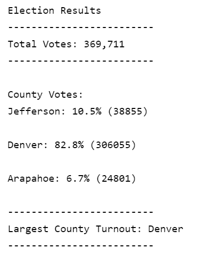
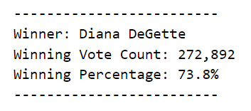

# Election-Analysis

## Overview of Election Audit
The purpose of the election analysis was to analyze the votes cast and determine the outcome of the election. In order to do this succicently, a python script was run to determine the outcome of the election and summarize accordingly. 

## Election-Audit Results
- How many votes were cast in this congressional election?

To begin the analysis, we used python to open and read the data. The file path was previously defined as _file_to_load_ and by using the _open_ and _cvs.reader_ methods, we are able to read the data within python. As our original data had headers, we used the _next_ function to skip that row for all future tasks. To calculate the total number of votes, we can tally them based on the number of rows remaining. _total_votes_ had previously been initialized with a value of 0. By using  _for_ loop to loop through the remaining rows, we increase the _total_vote_ count by one to find the total vote count. This can be shown in the script below. 

      # Initialize a total vote counter.
      total_votes = 0

      with open(file_to_load) as election_data:
        reader = csv.reader(election_data)
        header = next(reader)
       
    # For each row in the CSV file.
     for row in reader:
        # Add to the total vote count
        total_votes = total_votes + 1
 
 The total number of votes cast was 369,711. 
 
- Provide a breakdown of the number of votes and the percentage of total votes for each county in the precinct.

To be able to break down the votes by county, we started by creating a list _county_list_ to hold the county names as well as a dictionary told hold each county's vote count. Using the appropriate index for the county name, we are able to incorporate an _if_ statement within the _for loop_. In this case as we cylcle through the rows, the _if_ statement checks to see if the county name was in the list previously. If not, then it adds it the list.

We then are able to utilize the _county_votes_ dictionary to hold the county names as keys and preset their values to 0. As each row cycles through the appropriate key we are able to add 1, thus summing the total number of votes by county. This can be seen below. 

      county_list =[]
      county_votes={}

      for row in reader:
        
        # Add to the total vote count
        total_votes = total_votes + 1

        county_name = row[1]

         if county_name not in county_list:

            county_list.append(county_name)

            county_votes[county_name]= 0

        county_votes[county_name] += 1

The percentages were calculated using the sum of each county's votes divided by the total votes. A variable _cty_votes_ was created to obtain the value for each _county_name_ key for the appropriate percentage. Each value for _cty_votes_ and _total votes_ was given the data type float to ensure we would get appropriate decimals in our calculation. 

       for county_name in county_votes:

              cty_votes = county_votes.get(county_name)

              cty_percentage = float(cty_votes)/ float(total_votes) * 100           

The results were as follows: 

Jefferson had 10.5% of the votes with 38,855 votes. Denver had 82.8% of the total votes with 306,055 votes and Arapahoe had 6.7% of the total with 24,801 votes. 

- Which county had the largest number of votes?

Overall, Denver county had the largest number of votes. They had over 80% of the total votes. This can be shown in the output of the script. 

<kbd><kbd>

- Provide a breakdown of the number of votes and the percentage of the total votes each candidate received.
 
Using a similar method to the county, we were able to obtain the total votes and percentage for each candidate. _candidate_options_ list was created to hold the list of the candidates and a _candidate_votes_ dictionary was created to hold the candidate name and a corresponding vote count for the value. Using the appropriate index for the candidate name (in this case 2, for column 3), we are able to incorporate another _if_ statement within the _for loop_. In this case as we cylcle through the rows, the _if_ statement checks to see if the candidate name was in the list previously. If not, then it adds it the list. 

We then are able to utilize the _candidate_votes_ dictionary to hold the candidate names as keys and preset their values to 0. As each row cycles through the appropriate key we are able to add 1, thus summing the total number of votes by candidates. Finally we are able to similarly tally the voes to calculate the total votes and corresponding percentage  This can be seen below. 

      
      # Candidate Options and candidate votes.
      candidate_options = []
      candidate_votes = {}
      
       # For each row in the CSV file.
          for row in reader:

              # Add to the total vote count
              total_votes = total_votes + 1

              # Get the candidate name from each row.
              candidate_name = row[2]

              # If the candidate does not match any existing candidate add it to the candidate list
              if candidate_name not in candidate_options:

                  # Add the candidate name to the candidate list.
                  candidate_options.append(candidate_name)

                  # And begin tracking that candidate's voter count.
                  candidate_votes[candidate_name] = 0

              # Add a vote to that candidate's count
              candidate_votes[candidate_name] += 1

            for candidate_name in candidate_votes:

              # Retrieve vote count and percentage
              votes = candidate_votes.get(candidate_name)
      
              vote_percentage = float(votes) / float(total_votes) * 100
 
Overall, the results were as follows: 

Charles Casper Stockham had 23.0% of the total votes with 85,213 votes. Diana DeGette had 73.8% of the total votes with 272,892 votes and Raymon Anthony Doane had 3.1% of the total votes with 11,606 votes 
    
- Which candidate won the election, what was their vote count, and what was their percentage of the total votes?
      
Using the previous _for_ loop for eaxh _candidate name_, we take it one step further to determine the winner. We incorporate an _if_ statement to determine who had the most votes and the highest winning percentage. Using those parameters, we are able to redefine the variables _winning_count_, _winning_candidate_, and _winning_percentage_. 
      
       for candidate_name in candidate_votes:

        votes = candidate_votes.get(candidate_name)
      
        vote_percentage = float(votes) / float(total_votes) * 100
      
        # Determine winning vote count, winning percentage, and candidate.
        if (votes > winning_count) and (vote_percentage > winning_percentage):
            winning_count = votes
            winning_candidate = candidate_name
            winning_percentage = vote_percentage
      
The winner of the election was Diana DeGette with 272,892 votes, for a total win percentage of 73.8. This can also be shown below in the output of the script. 
   
<kbd><kbd>      
      
## Election-Audit Summary
      
In a summary statement, provide a business proposal to the election commission on how this script can be used—with some modifications—for any election. Give at least two examples of how this script can be modified to be used for other elections.
      
This script overall was an efficient manner in analyzing the votes cast based on our data set. Though it was set up specifically for our data set, we could modify it to fit other elections. The data provided was in common CSV format, but it is possible that the data was presented with other delimiters. In this case we would have to modify the code to specify a delimiter when opening. Using the _reader_ method, we would have to specify the appropriate delimiter. 
      
It is also possible to have a more complex data set. In this case, we were provided with the basic level of data, the ballot id, county, and candidate. If we were provided with more columns, we would simply have to modify the indexes selected to grab the data. In the case of county votes, we selected _row[1]_ to indicate it was the second column of our data. The addition of more columns would just require a simple modification to be able to identify the correct index reference to the new appropriate column. 
      
Overall, the script functionality is flexible enough to be modified for other elections. Depending on how the data is provided, it would only take minor changes to be able to get the same outcomes.
